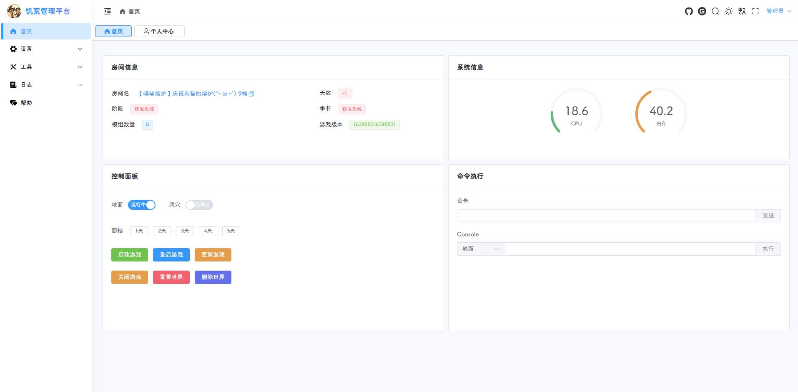
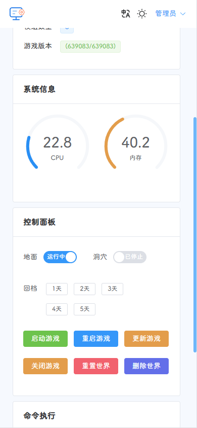
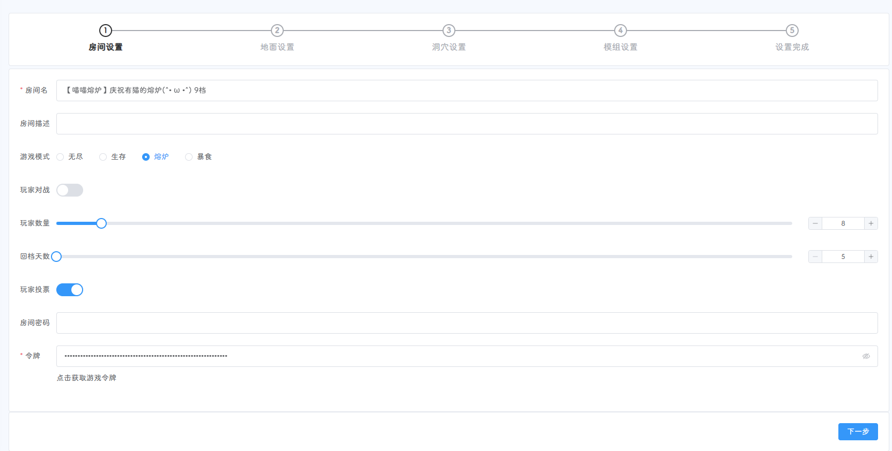
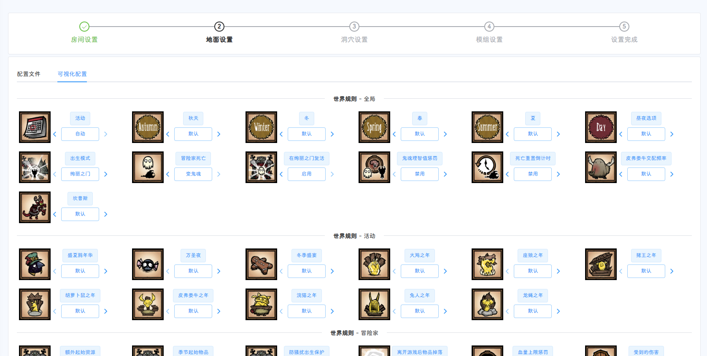
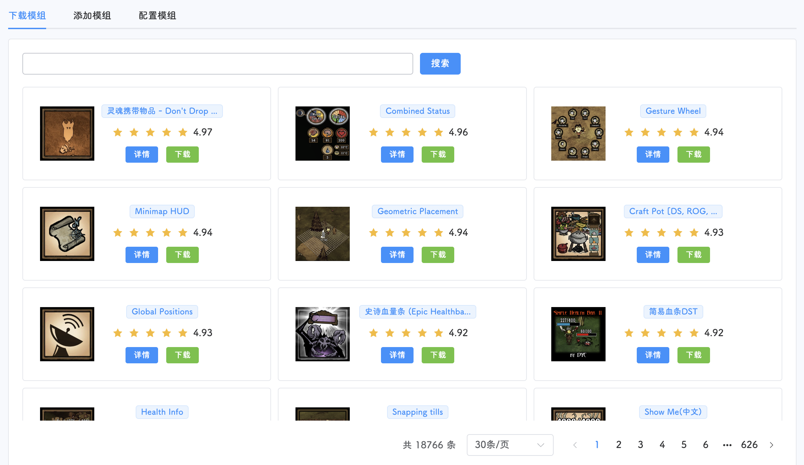
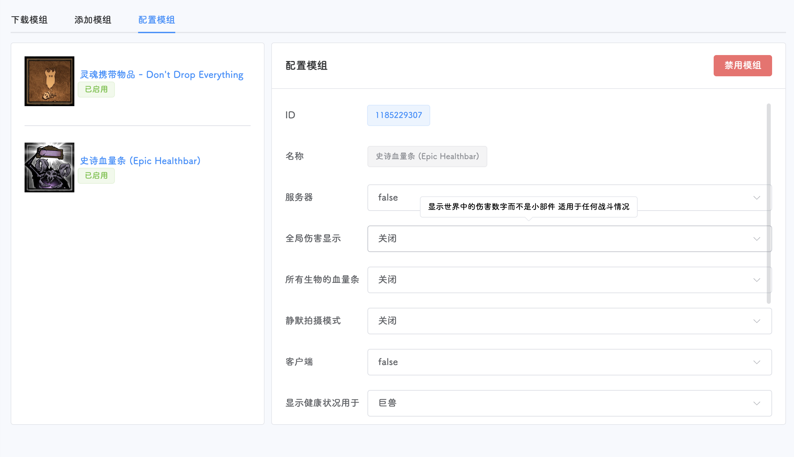
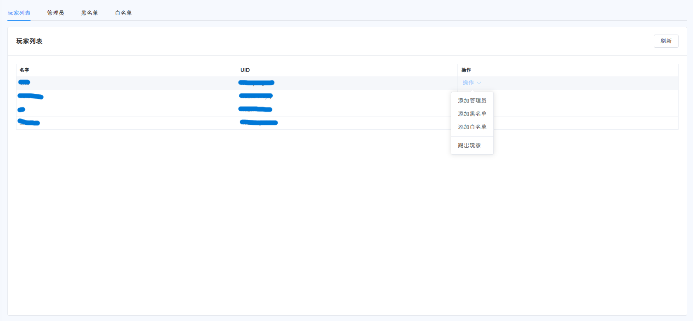
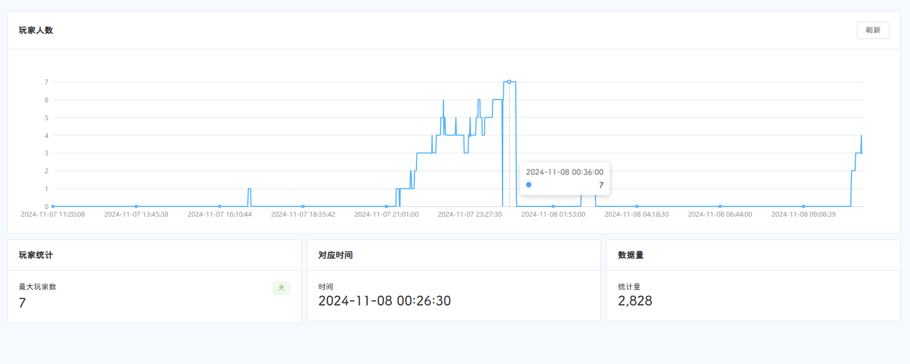
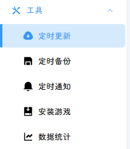

# [中文文档] | [[English README]](README_EN.md)
## :lemon: 饥荒管理平台App来啦  
[https://github.com/miracleEverywhere/dst-management-platform-desktop](https://github.com/miracleEverywhere/dst-management-platform-desktop)  

## :watermelon: 使用方法
>**建议使用 Ubuntu 24系统，低版本系统可能会出现GLIBC版本报错**  
```shell
# 执行以下命令，下载脚本
cd ~ && wget https://dmp-1257278878.cos.ap-chengdu.myqcloud.com/run.sh && chmod +x run.sh
```
```shell
# 自定义启动端口（8082改为你要用的端口），请手动修改run.sh文件或者
sed -i 's/^PORT=.*/PORT=8082/' run.sh
```
```shell
# 根据系统提示输入并回车
./run.sh
```
**更新方法**
```shell
cd ~ && ./run.sh
```
根据提示输入4
```shell
# root@VM-0-16-ubuntu:~# cd ~ && ./run.sh
饥荒管理平台(DMP)
--- https://github.com/miracleEverywhere/dst-management-platform-api ---
————————————————————————————————————————————————————————————
[0]: 下载并启动服务(Download and start the service)
————————————————————————————————————————————————————————————
[1]: 启动服务(Start the service)
[2]: 关闭服务(Stop the service)
[3]: 重启服务(Restart the service)
————————————————————————————————————————————————————————————
[4]: 更新管理平台(Update management platform)
[5]: 强制更新平台(Force update platform)
[6]: 更新启动脚本(Update startup script)
————————————————————————————————————————————————————————————
[7]: 设置虚拟内存(Setup swap)
[8]: 退出脚本(Exit script)
————————————————————————————————————————————————————————————
请输入选择(Please enter your selection) [0-8]:
```
如果下载了发行版，则执行以下命令：
```shell
# -c 为开启日志，建议开启
nohup ./dmp -c > dmp.log 2>&1 &
```
默认启动端口为80，如果您想修改，则修改启动命令：
```shell
# 修改端口为8888
nohup ./dmp -c -l 8888 > dmp.log 2>&1 &
```
也可以指定数据库文件的存储目录  
```shell
# 开启控制台输出，监听8899端口，DstMP.sdb的存储位置为 ./config/DstMP.sdb
nohup ./dmp -c -l 8899 -s ./config > dmp.log 2>&1 &
```
**docker部署方式**  
首先在package页面获取docker镜像tag  
建议映射config、dst和.klei目录  

```shell
# 绑定80端口 映射到/app目录下
docker run -itd --name dmp -p 80:80 \
-v /app/config:/root/config \
-v /app/dst:/root/dst \
-v /app/.klei:/root/.klei \
-v /app/steamcmd:/root/steamcmd \
-v /etc/localtime:/etc/localtime:ro \
-v /etc/timezone:/etc/timezone:ro \
ghcr.io/miracleeverywhere/dst-management-platform-api:tag
```
```shell
# 绑定8000端口 映射到/app目录下
docker run -itd --name dmp -p 8000:80 \
-v /app/config:/root/config \
-v /app/dst:/root/dst \
-v /app/.klei:/root/.klei \
-v /app/steamcmd:/root/steamcmd \
-v /etc/localtime:/etc/localtime:ro \
-v /etc/timezone:/etc/timezone:ro \
ghcr.io/miracleeverywhere/dst-management-platform-api:tag
```
```shell
# 使用host网络，并绑定8080端口
docker run -itd --name dmp --net=host \
-e DMP_PORT=8080 \
-v /app/config:/root/config \
-v /app/dst:/root/dst \
-v /app/.klei:/root/.klei \
-v /app/steamcmd:/root/steamcmd \
-v /etc/localtime:/etc/localtime:ro \
-v /etc/timezone:/etc/timezone:ro \
ghcr.io/miracleeverywhere/dst-management-platform-api:tag
```
**docker更新**  
停止旧版本容器，拉取新版本镜像，使用上述启动命令启动即可  
如果有映射config、dst和.klei目录，则无需重复安装游戏等操作  

**MacOS安装**  
> 只支持M系列CPU的Mac
```shell
cd ~ && wget https://dmp-1257278878.cos.ap-chengdu.myqcloud.com/run_macos.sh && chmod +x run_macos.sh
# 请输入需要执行的操作(Please enter the operation to be performed): 
# [0]: 下载并启动服务(Download and start the service) 
# [1]: 启动服务(Start the service) 
# [2]: 关闭服务(Stop the service) 
# [3]: 重启服务(Restart the service) 
# [4]: 更新服务(Update the service) 
```
选择0下载并启动，启动完成后运行manual_install.sh脚本安装游戏，无法在页面进行安装
```shell
./manual_install.sh
```
>注意：MacOS由于系统原因，模组配置暂不可用，需要点击设置-模组-添加模组页面的导出按钮，点击后会在桌面生成名为dmp_exported_mod的目录，用户需使用 **访达** 将改目录中的模组复制到~/dst/dontstarve_dedicated_server_nullrenderer/Contents/mods目录下。更新模组需要在设置-模组-添加模组页面删除对应要更新的模组，然后重新下载该模组，执行导出和复制操作后，重启游戏服务器。
---

## :grapes: 默认用户名密码
>登录后请尽快到右上角用户名-个人中心页面修改密码
>
>>初始密码：
>>admin/123456

---

## :cherries: 平台截图

  


  


  








  


  


  

  

---

## :strawberry: 文件介绍
```text
.
├── dmp                 # 主程序
├── dmp.log             # 请求日志
├── dmpProcess.log      # 运行日志
├── DstMP.sdb           # 数据库
├── manual_install.sh   # 饥荒手动安装脚本
└── run.sh              # 运行脚本
```

---

## :peach: 项目介绍
```text
.
├── app
│   ├── auth                    # 登录鉴权
│   ├── externalApi             # 外部接口
│   ├── home                    # 首页
│   ├── logs                    # 日志
│   ├── setting                 # 配置
│   └── tools                   # 工具
├── dist                        # 静态资源
│   ├── assets 
│   ├── index.html
│   ├── index.html.gz
│   └── vite.png
├── docker                      # 容器镜像
│   ├── Dockerfile
│   └── entry-point.sh
├── docs                        # 帮助文档
│   └── images
├── DstMP.sdb                   # 数据库
├── go.mod
├── go.sum
├── LICENSE
├── main.go
├── README.md
├── scheduler                   # 定时任务
│   ├── init.go
│   └── schedulerUtils.go
└── utils                       # 工具集
    ├── constant.go
    ├── exceptions.go
    ├── install.go
    ├── logger.go
    ├── scripts.go
    └── utils.go
```
##  :sparkling_heart: 致谢
本项目[前端页面](https://github.com/miracleEverywhere/dst-management-platform-web)基于**koi-ui**二次开发，感谢开源 [@yuxintao6](https://github.com/yuxintao6)  
[[koi-ui gitee]](https://gitee.com/BigCatHome/koi-ui)  
[[koi-ui github]](https://github.com/yuxintao6/koi-ui)  
